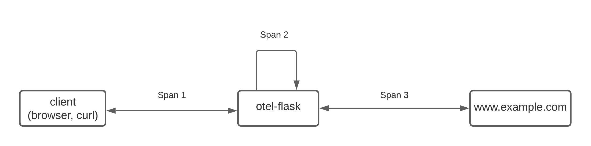
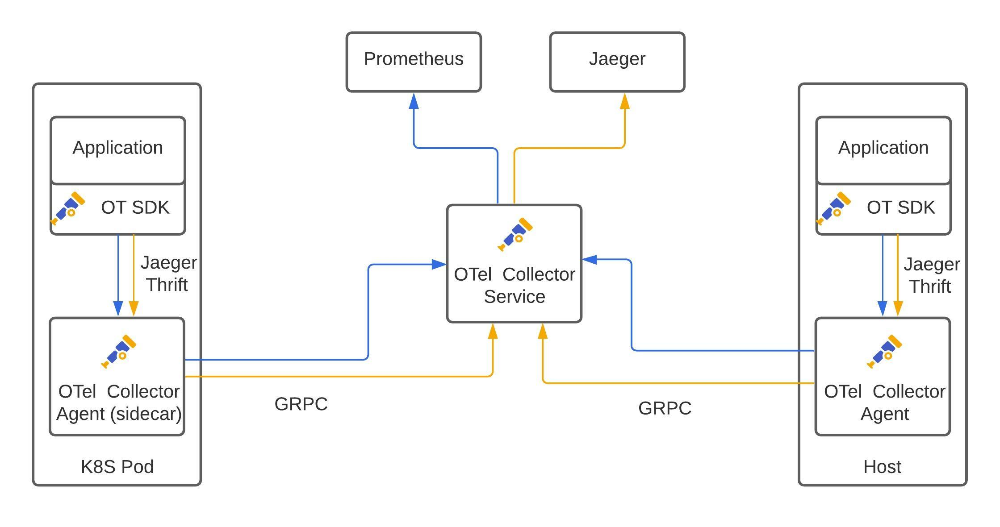

# Python Flask Hello World

A demo of GitOPs deployment automation and Opentelemetry-based observability on Openshift containter platform using a Python Flask app.

## Application Architecture


This is a demo app that is borrowed from [OpenTelemetry Python Get Started](https://opentelemetry-python.readthedocs.io/en/stable/getting-started.html). What the application does is listening on port 5000 for HTTP request. For each received request, before the app responses with word 'hello', it launches another HTTP request towards 'www.example.com' and receives a HTTP response.

This demo app is instrumented with OpenTelemetry API/SDK. Also both the Flask framework and HTTP request library are instrumented. So all the HTTP request/response the demo app receives/sends through Flask or HTTP request lib will be automatically captured and sent to the defined Otel agent(this demo app assumes the Otel agent is installed on localhost and listening on port 6831 for jaeger thrift formatted traces). The demo app also inserts another span inbetween the received HTTP request from the clients and the new HTTP request it sends to the external website with the name 'example-request'.

## Build a Container Image for the Python Flask App

You will need to have docker installed on your laptop or VM to build a container image for this demo app. First 'git clone' this repo and then change the directory to where the 'Dockerfile; is located.
Then use the following command to build and publish the contaier image to 'docker.io'. You can use whatever container registry you like, if you prefer to use a different container registry, please modify the deployment YAML file under kubernetes as well to use the right container image URL.

```
[centos@centos8 otel-hello-world]$ docker build -t docker.io/haoruibing/otel-flask -f Dockerfile.slim .
[centos@centos8 otel-hello-world]$ docker push docker.io/haoruibing/otel-flask
```
Note: 'Dockerfile.slim' will build a container image running as a regular user 'flasky' while 'Dockerfile' will build a container image running as 'root'.
## Auto injection of OpenTelemetry Agent as a Sidecar container

This demo app assumes an OpenTelemetry-based Jaeger Collector instance has been deployed in the namespace where the demo app will be deployed. A sample YAML file to deploy an all-in-one configuration Jaeger is provided in the 'jaeger-all-in-one.yaml' under 'kubernetes' folder. 

Also to inform the Openshift platform Jaeger operator to automatically inject the jaeger-agent as a sidecar into the demo app pod, in the 'otel-flask-deployment.yaml' file under 'kubernetes' folder, an extra line 
```
 sidecar.jaegertracing.io/inject: "true"
```
has been added so the jaeger operator will be triggered to automatically inject a jaeger-agent sidecar into the otel-flask deployment, also the jaeger-agent will be automatically wired to send traces to the (specified) jaeger-collector that has been deployed by the jaeger operator. 

The traces will be sent from the demo app -> local jaeger otel agent -> jaeger otel collector -> jaeger UI.  
## Distributed Tracing using Open Telemetry-based Jaeger


## GitOps Deployment

The deployment of this demo app is automated using ArgoCD into the Openshift container platform. Below is the ArgoCD application YAML file under the 'argo' folder. You can run 'oc apply -f argocd-python-flask.yaml' to onboard this application on to ArgoCD.

```
apiVersion: argoproj.io/v1alpha1
kind: Application
metadata:
  name: argocd-python-flask
  namespace: openshift-gitops
spec:
  destination:
    namespace: argocd-python-flask
    server: https://kubernetes.default.svc
  project: default
  source:
    directory:
      recurse: true
    path: kubernetes
    repoURL: https://github.com/ruibinghao/otel-hello-world.git
    targetRevision: main
  syncPolicy:
    automated:
      prune: true
      selfHeal: true
```
